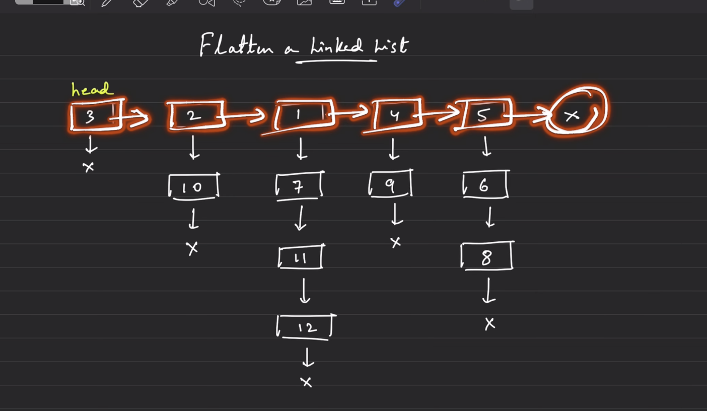

# Linked List Part 3: DLL Medium and LL Hard Problems


## Node Structures

```cpp
#include <bits/stdc++.h>
using namespace std;

struct Node {
    int data;
    Node* next;

    Node(int data1) {
        data = data1;
        next = nullptr;
    }

    Node(int data1, Node* next1) {
        data = data1;
        next = next1;
    }
};

struct DNode {
    int data;
    DNode* prev;
    DNode* next;

    DNode(int data1) {
        data = data1;
        prev = nullptr;
        next = nullptr;
    }
};


```

## 25. Delete All Occurrences of a Key in DLL

### Problem

Delete every node whose value is equal to `key` from a doubly linked list.

### Brute Approach

Store non-key values and rebuild a new DLL.

```cpp
DNode* deleteAllOccurrencesBrute(DNode* head, int key) {
    // Hint: brute mein links handle nahi karte; valid values se fresh DLL banao.
    vector<int> values;
    DNode* temp = head;

    while (temp != nullptr) {
        if (temp->data != key) values.push_back(temp->data);
        temp = temp->next;
    }

    return convertArrayToDLL(values);
}
```

Time Complexity: O(n)  
Space Complexity: O(n)

### Better

No separate better approach needed.

### Optimal Approach

Traverse and delete matching nodes by adjusting `prev` and `next`.

```cpp
DNode* deleteAllOccurrencesOptimal(DNode* head, int key) {
    // Hint: delete karte waqt previous aur next dono links repair karo.
    DNode* temp = head;

    while (temp != nullptr) {
        

        if (temp->data == key) {
            if(temp ==head){
                  head= head->next;

                  
            }

            DNode* previous = temp->prev;
            Dnode* front= temp ->front;
            if( previous)  previous->next= front;
            if( front)front->prev= previous;
          delete temp;
         temp= front;
            
        }
        else{
             temp =temp->next;
        }
    }
    reutrn head;
           
}
```

Time Complexity: O(n)  
Space Complexity: O(1)

## 26. Find Pairs with Given Sum in Doubly Linked List

### Problem

Given a sorted DLL, find all pairs whose sum is equal to target.

### Brute Approach

Use two nested loops.

```cpp
vector<pair<int, int>> findPairsDLLBrute(DNode* head, int target) {
    // Hint: sorted property use nahi kar rahe, isliye brute O(n^2).
    vector<pair<int, int>> ans;

   temp1=head;
   while( temp1!=nullptr){
         tem2= temp1->next;
         while(temp2!=nullptr){

            if( temp1->data+ temp2->data==target){
                and. push_back({temp1->data,temp2->data});
            }
            temp2=temp2->next;
         }
         temp1=temp1->next;
   }

    return ans;
}
```

Time Complexity: O(n²)  
Space Complexity: O(1), excluding answer

### Better Approach

Use hashing while traversing.

```cpp
vector<pair<int, int>> findPairsDLLBetter(DNode* head, int target) {
    // Hint: need = target - current value.
    unordered_set<int> seen;
    vector<pair<int, int>> ans;

    DNode* temp = head;
    while (temp != nullptr) {
        int need = target - temp->data;
        if (seen.count(need)) {
            ans.push_back({need, temp->data});
        }
        seen.insert(temp->data);
        temp = temp->next;
    }

    return ans;
}
```

Time Complexity: O(n) average  
Space Complexity: O(n)

### Optimal Approach

Use two pointers: one at head and one at tail.

```cpp
DNode* findTailDLL(DNode* head) {
    // Hint: right pointer ke liye tail chahiye.
     DNode* temp= head;
    while ( temp->next != nullptr) {
        temp = temp->next;
    }
    return temp;
}

vector<pair<int, int>> findPairsDLLOptimal(DNode* head, int target) {
    // Hint: sum small ho to left++, sum large ho to right--.
    vector<pair<int, int>> ans;
    if (head == nullptr) return ans;

    DNode* left = head;
    DNode* right = findTailDLL(head);

    while (left->data < right->data) {
        int sum = left->data + right->data;

        if (sum == target) {
            ans.push_back({left->data, right->data});
            left = left->next;
            right = right->prev;
        } else if (sum < target) {
            left = left->next;
        } else {
            right = right->prev;
        }
    }

    return ans;
}
```

Time Complexity: O(n)  
Space Complexity: O(1), excluding answer

## 27. Remove Duplicates from Sorted DLL

### Problem

Remove duplicate nodes from a sorted doubly linked list.

### Brute Approach

Store unique values and rebuild the DLL.

```cpp
DNode* removeDuplicatesDLLBrute(DNode* head) {
    // Hint: sorted DLL se unique values set/vector mein nikalo.
    vector<int> values;
    DNode* temp = head;

    while (temp != nullptr) {
        if (values.empty() || values.back() != temp->data) {
            values.push_back(temp->data);
        }
        temp = temp->next;
    }

    return convertArrayToDLL(values);
}
```

Time Complexity: O(n)  
Space Complexity: O(n)

### Better

No separate better approach needed.

### Optimal Approach

For each unique node, skip all following duplicate nodes.

```cpp
DNode* removeDuplicatesDLLOptimal(DNode* head) {
    // Hint: sorted list hai, duplicates hamesha adjacent honge.
    DNode* temp = head;

    while (temp != nullptr && temp->next != nullptr) {
        DNode* nextNode = temp->next;

        while (nextNode != nullptr && nextNode->data == temp->data) {
            DNode* duplicate = nextNode;
            nextNode = nextNode->next;
            delete duplicate;
        }

        temp->next = nextNode;
        if (nextNode != nullptr) nextNode->prev = temp;
        temp = temp->next;
    }

    return head;
}
```

Time Complexity: O(n)  
Space Complexity: O(1)

## 28. Reverse LL in Group of Given Size K

### Problem

Reverse nodes in groups of size `k`. If the remaining nodes are fewer than `k`, keep them unchanged.

### Brute Approach

Use a stack to reverse values inside every full group.

```cpp
Node* reverseKGroupBrute(Node* head, int k) {
    // Hint: brute mein values reverse hote hain, links nahi.
    if (head == nullptr || k <= 1) return head;

    Node* temp = head;

    while (temp != nullptr) {
        stack<int> st;
        Node* groupStart = temp;
        Node* check = temp;

        for (int i = 0; i < k; i++) {
            if (check == nullptr) return head;
            st.push(check->data);
            check = check->next;
        }

        for (int i = 0; i < k; i++) {
            groupStart->data = st.top();
            st.pop();
            groupStart = groupStart->next;
        }

        temp = check;
    }

    return head;
}
```

Time Complexity: O(n)  
Space Complexity: O(k)

### Better

No separate better approach needed.

### Optimal Approach

Find kth node, cut the group, reverse links, then reconnect.

```cpp
Node* getKthNode(Node* temp, int k) {// temp is pass by value
    // Hint: kth node na mile to remaining group reverse nahi karna.
     int count=0;
    while (temp != nullptr ) {
        count++;
        if( count==k)break;
        temp = temp->next;
    }
    return temp;
}

Node* reverseKGroupOptimal(Node* head, int k) {
    // Hint: prevGroupLast reconnect karne ke kaam aata hai.
    if (head == nullptr || k <= 1) return head;

    Node* temp = head;
    Node* prevGroupLast = nullptr;

    while (temp != nullptr) {
        Node* kthNode = getKthNode(temp, k);
        if (kthNode == nullptr) {
            if (prevGroupLast) prevGroupLast->next = temp;
            break;
        }

        Node* nextGroup = kthNode->next;
        kthNode->next = nullptr;

        reverseSLLIterativeOptimal(temp);

        if (temp == head) {
            head = kthNode;
        } else {
            prevGroupLast->next = kthNode;
        }

        prevGroupLast = temp;
        temp = nextGroup;
    }

    return head;
}
```

Time Complexity: O(n)  
Space Complexity: O(1)

## 29. Rotate a LL

### Problem

Rotate a linked list to the right by `k` places.

### Brute Approach

Move the last node to the front one rotation at a time.

```cpp
Node* rotateRightBrute(Node* head, int k) {
    // Hint: k baar last node ko head banao; slow but easy.
    if (head == nullptr || head->next == nullptr || k == 0) return head;

    while (k--) {
        Node* temp = head;
        while (temp->next->next != nullptr) {
            temp = temp->next;
        }

        Node* last = temp->next;
        temp->next = nullptr;
        last->next = head;
        head = last;
    }

    return head;
}
```

Time Complexity: O(k × n)  
Space Complexity: O(1)

### Better

No separate better approach needed.

### Optimal Approach

Find length, connect tail to head to form a circle, then break at the correct point.

```cpp
Node* rotateRightOptimal(Node* head, int k) {
    // Hint: right rotate k == left break at length-k.
    if (head == nullptr || head->next == nullptr || k == 0) return head;

    int length = 1;
    Node* tail = head;
    while (tail->next != nullptr) {
        length++;
        tail = tail->next;
    }

    k = k % length;
    if (k == 0) return head;

    tail->next = head;
    int stepsToNewTail = length - k;

    Node* newTail = head;
    int  count=0;
    while(newTail!=nullptr){
        count++;
        if( count==stepsToNewTAil)break;
        newTail=newTRail->next;

    }

   
    Node* newHead = newTail->next;
    newTail->next = nullptr;

    return newHead;
}
```

Time Complexity: O(n)  
Space Complexity: O(1)

## 30. Flattening of LL
```cpp
struct RNode {
    int data;
    RNode* next;
    RNode* random;

    RNode(int data1) {
        data = data1;
        next = nullptr;
        random = nullptr;
    }
};

struct CNode {
    int data;
    CNode* next;
    CNode* child;

    CNode(int data1) {
        data = data1;
        next = nullptr;
        child = nullptr;
    }
};
```

### Problem

Given a linked list where each node has `next` and `child` pointers, flatten it into one sorted list using `child` pointers.

### Brute Approach

Collect all values, sort them, and create a new child-linked list.

```cpp
CNode* createChildList(vector<int>& values) {
    // Hint: flattened list child pointers se banegi, next pointers nullptr rahenge.
    if (values.empty()) return nullptr;

    CNode* head = new CNode(values[0]);
    CNode* temp = head;

    int n = values.size();
    for (int i = 1; i < n; i++) {
        temp->child = new CNode(values[i]);
        temp = temp->child;
    }

    return head;
}

CNode* flattenLLBrute(CNode* head) {
    // Hint: sab nodes ko array mein daalo, sort karo, fresh vertical list banao.
    vector<int> values;
    CNode* temp =head;

    while ( temp!= nullptr) {
        CNode* t1= temp;
        while (t1 != nullptr) {
            values.push_back(t1->data);
            t1 = t1->child;
        }
        temp = temp->next;
    }

    sort(values.begin(), values.end());
    return createChildList(values);
}
```

Time Complexity: O(T log T), where `T` is total nodes  
Space Complexity: O(T)

### Better

No separate better approach needed.

### Optimal Approach

Recursively flatten the right side, then merge two sorted child lists.

```cpp
CNode* mergeChildLists(CNode* list1, CNode* list2) {
    // Hint: merge normal sorted LL jaisa, bas next ki jagah child use hota hai.
    CNode* dummy = new CNode(-1);
    CNode* res = dummy;

    while (list1 != nullptr && list2 != nullptr) {
        if (list1->data < list2->data) {
            res->child = list1;
            list1 = list1->child;
        } else {
            res->child = list2;
            list2 = list2->child;
        }
        res = res->child;
        res->next = nullptr;//because wewant to make vertical linked list
    }

    if (list1 != nullptr) res->child = list1;
    else res->child = list2;

    CNode* mergedHead = dummy->child;
    delete dummy;
    return mergedHead;
}

CNode* flattenLLOptimal(CNode* head) {
    // Hint: right side flatten karo, current vertical list se merge karo.
    if (head == nullptr || head->next == nullptr) return head;

    CNode* mergedHead = flattenLLOptimal(head->next);
    head = mergeChildLists(head, mergedHead);

    return head;
}
```

Time Complexity: O(T × K) worst case, where `K` is number of top-level lists  
Space Complexity: O(K), recursion stack

## 31. Clone a LL with Random and Next Pointer

### Problem

Clone a linked list where each node has `next` and `random` pointers.

### Brute Approach

Create a hash map from original node to copied node, then connect `next` and `random`.

```cpp
RNode* cloneRandomListBrute(RNode* head) {
    // Hint: map original address -> clone address.
    unordered_map<RNode*, RNode*> mp;
    RNode* temp = head;

    while (temp != nullptr) {
        mp[temp] = new RNode(temp->data);
        temp = temp->next;
    }

    temp = head;
    while (temp != nullptr) {
        mp[temp]->next = mp[temp->next];
        mp[temp]->random = mp[temp->random];
        temp = temp->next;
    }

    return mp[head];
}
```

Time Complexity: O(2n) average  
Space Complexity: O(n)

### Better

No separate better approach needed.

### Optimal Approach

Insert cloned nodes between original nodes, assign random pointers, then separate both lists.

```cpp

void insertCopyInBetween(RNode* head) {
    // Hint: A->B ko A->A'->B bana do.
    RNode* temp = head;

    while (temp != nullptr) {
        RNode* copyNode = new RNode(temp->data);
        copyNode->next = temp->next;
        temp->next = copyNode;
        temp = temp->next->next;
    }
}

void connectRandomPointers(RNode* head) {
    // Hint: original->random ka copy original->random->next par hai.
    RNode* temp = head;

    while (temp != nullptr) {
        RNode* copyNode = temp->next;
        if (temp->random != nullptr) {
            copyNode->random = temp->random->next;
        } else {
            copyNode->random = nullptr;
        }
        temp = temp->next->next;
    }
}

RNode* getDeepCopyList(RNode* head) {
    // Hint: mixed list ko original aur copy mein split karo.
    RNode* dummy = new RNode(-1);
    RNode* res = dummy;
    RNode* temp = head;

    while (temp != nullptr) {
        res->next = temp->next;
        res = res->next;

        temp->next = temp->next->next;
        temp = temp->next;
    }

    RNode* copiedHead = dummy->next;
    delete dummy;
    return copiedHead;
}

RNode* cloneRandomListOptimal(RNode* head) {
    // Hint: 3 steps: insert copies, connect random, detach copy list.
    if (head == nullptr) return nullptr;

    insertCopyInBetween(head);
    connectRandomPointers(head);
    return getDeepCopyList(head);
}
```

Time Complexity: O(3n)  
Space Complexity: O(1), excluding the new copied list
## 32. Design browser history:
 ```cpp
   /*implement homepage
   implement visit
   implement back(ksteps);
   implement forward(k)step;
*/
struct Node{
      string data;
      Node* next;
      Node* back;
      Node(){
        data="";
        next=nullptr;
        back= nullptr;
      }
      Node(string x){
         data=x;
        next=nullptr;
        back= nullptr;
      }
      Node(string x, Node*next1){
         data=x;
        next=next1;
        back= nullptr;
      }
      Node(string x, Node*next1, Node* pre){
         data=x;
        next=next1;
        back= pre;
      }

};

Class Browser{
      Node* currentPage;
      public:
     Browser(String & homapage){
            current=new Node(homapage);

     }
     void visit(string &  url){
          Node* newNode=new Node( url);
          currentPage->next=newNode;
          newNode->back=currentPage;
          currentPage= current-> next;
     }
     String back(int k){
           while(k){
              if(currentPage->back)currentPage=currentPage->back;
              else{
                 break;
              }
              k--;
           }
           return currentPage->data;
     }
     string forward(int k){
           while(k){
              if( currentPage->next){
                 cur=cur->next;
              }
              else{
                 break;
              }
              k--;
           }
            return currentPage->data;

     }


};


   
 ```
 ## merge k sorted linked list
 ## Problem

Given `k` sorted linked lists, merge all of them into one sorted linked list and return the head.

Example:

```text
Input:
List 1: 1 -> 4 -> 5
List 2: 1 -> 3 -> 4
List 3: 2 -> 6

Output:
1 -> 1 -> 2 -> 3 -> 4 -> 4 -> 5 -> 6
```

## Node Structure

```cpp
#include <bits/stdc++.h>
using namespace std;

struct Node {
    int data;
    Node* next;

    Node() {
        data = 0;
        next = nullptr;
    }

    Node(int value) {
        data = value;
        next = nullptr;
    }

    Node(int value, Node* nextNode) {
        data = value;
        next = nextNode;
    }
};
```

## Approach 1: Brute Force Using Array

### Idea

Put all linked-list values into an array, sort the array, then create a new sorted linked list.

### Code

```cpp
Node* createListFromArray(vector<int>& values) {
    // Hint: sorted array se fresh linked list banao.
    if (values.empty()) return nullptr;

    Node* head = new Node(values[0]);
    Node* temp = head;

    int n = values.size();
    for (int i = 1; i < n; i++) {
        temp->next = new Node(values[i]);
        temp = temp->next;
    }

    return head;
}

Node* mergeKListsBrute(vector<Node*>& lists) {
    // Hint: sab nodes ke values array mein daalo, sort karo, new LL banao.
    vector<int> values;

    for (Node* head : lists) {
        Node* temp = head;
        while (temp != nullptr) {
            values.push_back(temp->data);
            temp = temp->next;
        }
    }

    sort(values.begin(), values.end());
    return createListFromArray(values);
}
```

### Complexity

Let `K` be number of linked lists and `N` be average length of each list. Total nodes = `K * N`.

Time Complexity: `O(K*N) + O((K*N) log(K*N)) + O(K*N)`  
Space Complexity: `O(K*N) + O(K*N)`

- `O(K*N)` to collect all values.
- `O((K*N) log(K*N))` to sort.
- `O(K*N)` to create the merged linked list.
- Extra array takes `O(K*N)`.
- New merged linked list takes `O(K*N)`.

## Approach 2: Better Approach — Merge Lists Two at a Time

### Idea

Use the standard “merge two sorted linked lists” logic. Start with the first list and keep merging the next list into it.

### Code

```cpp
Node* mergeTwoSortedLists(Node* list1, Node* list2) {
    // Hint: dummy node use karo; result banana easy ho jaata hai.
    Node* dummy = new Node(-1);
    Node* temp = dummy;

    while (list1 != nullptr && list2 != nullptr) {
        if (list1->data <= list2->data) {
            temp->next = list1;
            list1 = list1->next;
        } else {
            temp->next = list2;
            list2 = list2->next;
        }
        temp = temp->next;
    }

    if (list1 != nullptr) {
        temp->next = list1;
    } else {
        temp->next = list2;
    }

    Node* mergedHead = dummy->next;
    delete dummy;
    return mergedHead;
}

Node* mergeKListsBetter(vector<Node*>& lists) {
    // Hint: answer ko one-by-one next list ke saath merge karte jao.
    if (lists.empty()) return nullptr;

    Node* head = lists[0];

    int k = lists.size();
    for (int i = 1; i < k; i++) {
        head = mergeTwoSortedLists(head, lists[i]);
    }

    return head;
}
```

### Complexity

Time Complexity: `O(K * K * N)`  
Space Complexity: `O(1)`

Why time is high:

- First merge roughly `N + N`.
- Next merge roughly `2N + N`.
- Next merge roughly `3N + N`.
- Total becomes approximately `O(N * K²)`.

## Approach 3: Optimal Approach — Min Heap / Priority Queue

### Idea

At any point, the smallest available node must be among the current heads of the `K` lists. Put all current heads into a min heap. Repeatedly take the smallest node, attach it to answer, and push its next node.

### Code

```cpp


Node* mergeKListsOptimal(vector<Node*>& lists) {
    // Hint: heap mein hamesha har list ka current smallest candidate rahega.
    priority_queue<pair< int ,Node*>, vector<pair< int, Node*>, greater<pair< int, Node*>>> minHeap;

    for (Node* head : lists) {
        if (head != nullptr) {
            minHeap.push( head->data, head);
        }
    }

    Node* dummy = new Node(-1);
    Node* temp = dummy;

    while (!minHeap.empty()) {
        auto it  = minHeap.top();
         minHeap.pop();

        

        if (it.second != nullptr) {
            minHeap.push({it.second->next->data, it.second->next});
        }
        temp->next = it.second;
        temp = temp->next;
    }

    Node* mergedHead = dummy->next;
    delete dummy;
    return mergedHead;
}
```

### Complexity

Time Complexity: `O(K log K) + O((K*N) log K)`  
Space Complexity: `O(K)`

- `O(K log K)` to push first node of each list into heap.
- For every one of `K*N` nodes, one pop happens and maybe one push happens.
- Each heap operation costs `O(log K)`.
- Heap stores at most `K` nodes at any time.

## Revision Hints

- Brute: `values array -> sort -> new linked list`.
- Better: `merge two sorted lists` repeatedly.
- Optimal: `min heap stores current head of each list`.
- If asked to reduce extra list creation, better/optimal can reuse existing nodes.
- Heap comparator is the most common mistake: for min heap, return `first->data > second->data`.
- Total nodes often written as `K*N`; if list sizes vary, call total nodes `M`.

